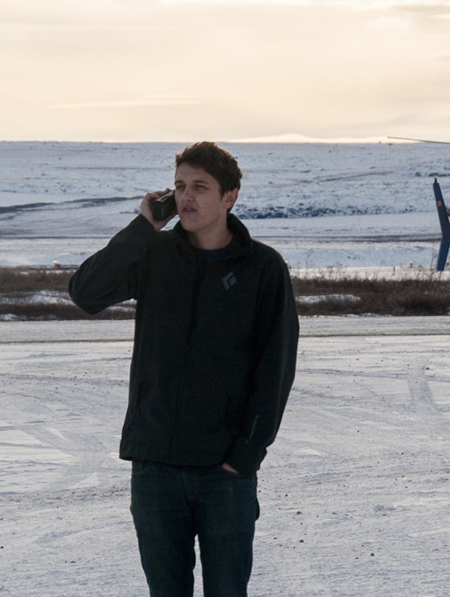



I’m a postdoc at NASA’s Goddard Space Flight Center and the University of Maryland -specializing in Arctic and Antarctic sea ice variability. 

I am a member of NASA's <a href="http://www.nasa.gov/mission_pages/icebridge/mission/index.html">Operation IceBridge project science office</a>, based at NASA's GSFC
<a href="http://science.gsfc.nasa.gov/earth/cryosphere/">Cryosperic Sciences Lab</a>,

I apply statistical/geospatial analysis, machine learning, and visualization techniques to a wide variety of polar climate datasets (modelled and observed), all primarily in Python. I also develop and run sea ice models (although not so much recently). Take a look around! Contact details below..

You can also follow me and find out more about my research, code, articles, and
data in the links above, or you can access my GitHub page, ORCID and Google Scholar links on the buttons below

<ul class="social">

<li>
<a href="https://github.com/akpetty">
{{fa("github-square", "fa-3x", "Github")}}
</a>
</li>

<li>
<a href="http://orcid.org/0000-0003-0307-3216">
{{ai("orcid-square", "fa-3x", "ORCID")}}
</a>
</li>

<li>
<a href="https://scholar.google.cl/citations?user=RZ8QtrEAAAAJ&hl=en">
{{ai("google-scholar-square", "fa-3x", "Google Scholar")}}
</a>
</li>

</ul>

My <a href="http://orcid.org">ORCID</a> number is
<a href="http://orcid.org/0000-0003-0307-3216">0000-0003-0307-3216</a>.

<!-- row -->

<h2>Education</h2>

<h3><a href="/about/phd.html"><b>PhD</b> in Climate Science  »</a></h3>
<ul class="fa-ul">
    <li><i class="fa-li fa fa-calendar fa-fw"></i>
        2010-2014
    </li>
    <li><i class="fa-li fa fa-university fa-fw"></i>
        <a href="https://www.ucl.ac.uk/">University College London, UK</a>
    </li>
    <li><i class="fa-li fa fa-graduation-cap fa-fw"></i>
        Advisor:
        <a href="http://www.met.reading.ac.uk/userpages/jb904445.php">Daniel Feltham</a>
        <a href="https://www.bas.ac.uk/profile/pahol/">Paul Holland</a>
    </li>
    <li><i class="fa-li fa fa-book fa-fw"></i>
        Thesis: Sea ice and the ocean mixed layer over the Antarctic shelf seas
    </li>
</ul>

<h3><b>MSc</b> in Physics  »</h3>
<ul class="fa-ul">
    <li><i class="fa-li fa fa-calendar fa-fw"></i>
        2006-2010
    </li>
    <li><i class="fa-li fa fa-university fa-fw"></i>
        <a href="http://www.bristol.ac.uk/">University of Bristol, UK</a>
    </li>
    <li><i class="fa-li fa fa-graduation-cap fa-fw"></i>
    </li>
    <li><i class="fa-li fa fa-book fa-fw"></i>
        Dissertation:
        Non-invasive detection of neural currents
    </li>
</ul>

<!-- row -->
